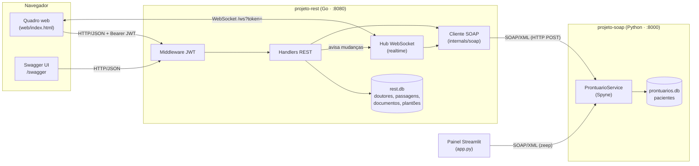
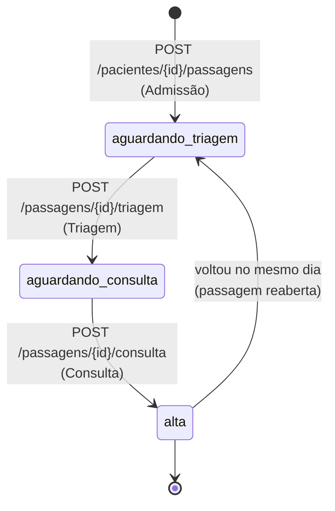
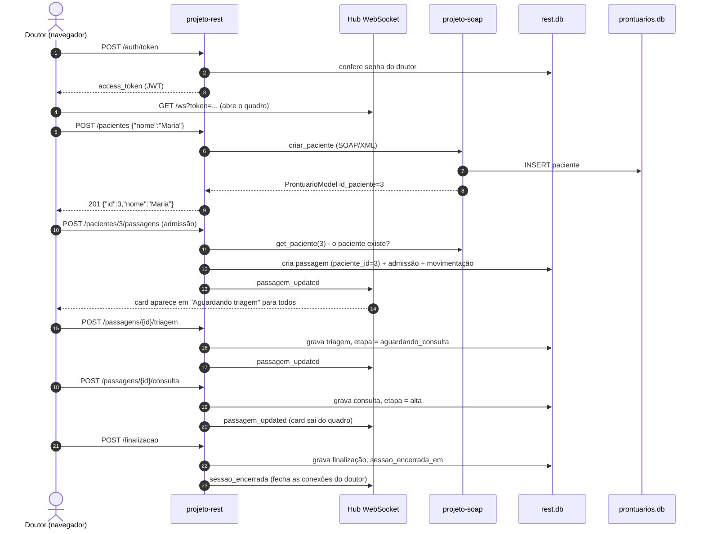

# API-Archtectures

Projeto para a aula de Arquitetura de APIs. Ele mostra, num mesmo sistema, os estilos **SOAP** e
**REST** funcionando juntos, mais um canal em tempo real via **WebSocket**.

O domínio é um **pronto-atendimento hospitalar**. Os doutores fazem login, registram a chegada
dos pacientes, fazem a triagem e a consulta (que dá alta) e, no fim do turno, finalizam o
plantão. Tudo isso acontece num quadro compartilhado, em que cada doutor vê o que os outros
estão fazendo.

| Projeto                          | Estilo              | Tecnologia                         | Porta  | Responsabilidade                                               |
|----------------------------------|---------------------|------------------------------------|--------|----------------------------------------------------------------|
| [projeto-soap](projeto-soap/)    | SOAP 1.1 + WSDL     | Python 3.11, Spyne, SQLite         | `8000` | **Dono dos dados do paciente** (cadastro, consulta, alteração, remoção) |
| [projeto-rest](projeto-rest/)    | REST + WebSocket    | Go, Gin, GORM, SQLite, JWT         | `8080` | Doutores, login, atendimentos (passagens), documentos, plantões e o quadro em tempo real |

Cada subprojeto tem um README com todos os detalhes:
[projeto-soap/README.md](projeto-soap/README.md) e [projeto-rest/README.md](projeto-rest/README.md).

---

## Visão geral da arquitetura



Os pontos principais:

1. **Os dados do paciente ficam só no SOAP.** O REST não tem tabela de pacientes. Toda vez que
   precisa de nome ou status, ele pergunta ao `ProntuarioService`. Não há cópia nem
   sincronização entre os bancos.
2. **O REST guarda o que acontece com o paciente no hospital.** Cada vinda é uma *passagem*,
   com três documentos (admissão, triagem e consulta). A passagem aponta para o paciente pelo
   `paciente_id`, que é o mesmo `id_paciente` do SOAP. É a única ligação entre os dois bancos.
3. **O navegador nunca fala direto com o SOAP.** O frontend e o Swagger usam apenas o REST
   (JSON). O REST traduz as chamadas para SOAP/XML e devolve JSON. O único cliente SOAP além
   do REST é o painel Streamlit, feito para demonstrar o serviço SOAP isolado.
4. **Cada serviço tem o seu banco SQLite** (`prontuarios.db` e `rest.db`), criados
   automaticamente na primeira execução.

---

## 1. projeto-soap: `ProntuarioService`

Serviço SOAP escrito com **Spyne** ([server.py](projeto-soap/server.py)). Ele é o "cadastro
central" de pacientes e publica um contrato formal em WSDL
([contrato_servico.wsdl](projeto-soap/contrato_servico.wsdl)), disponível também em
`http://127.0.0.1:8000/?wsdl`.

### O que ele faz

Expõe cinco operações sobre o tipo `ProntuarioModel`:

| Operação SOAP                                  | Retorno              | O que faz                                    |
|------------------------------------------------|----------------------|----------------------------------------------|
| `get_paciente(id_paciente)`                    | `ProntuarioModel`    | Busca um paciente pelo ID                    |
| `list_pacientes()`                             | `ProntuarioModel[]`  | Lista todos, em ordem alfabética             |
| `criar_paciente(paciente, status)`             | `ProntuarioModel`    | Cadastra um paciente novo                    |
| `atualizar_paciente(id_paciente, paciente, status)` | `ProntuarioModel` | Altera nome e status                       |
| `remover_paciente(id_paciente)`                | `ProntuarioModel`    | Remove e devolve o registro removido         |

`ProntuarioModel` tem `id_paciente`, `paciente` (nome), `status` (situação clínica),
`criado_em`, `atualizado_em` e `mensagem_erro`.

### Como ele sinaliza erros

Os dois mecanismos típicos do SOAP aparecem aqui:

- **Paciente inexistente:** a resposta é normal, mas vem com `mensagem_erro = "Paciente não encontrado"`.
- **Dado inválido** (nome vazio, nome com mais de 100 caracteres, status com mais de 50): o
  serviço devolve um **SOAP Fault** com `faultcode = Client.Validacao`.

### Arquivos

| Arquivo                                           | Papel                                                                 |
|---------------------------------------------------|-----------------------------------------------------------------------|
| [server.py](projeto-soap/server.py)               | Define o serviço, o modelo e as validações, e sobe o servidor WSGI    |
| [banco.py](projeto-soap/banco.py)                 | Persistência em SQLite. Cria José (1) e Roberto (2) se o banco estiver vazio |
| [app.py](projeto-soap/app.py)                     | Painel **Streamlit** que consome o WSDL com **zeep**: consulta, cadastro e listagem |
| [contrato_servico.wsdl](projeto-soap/contrato_servico.wsdl) | Contrato do serviço                                       |
| [server_test.py](projeto-soap/server_test.py), [e2e_test.py](projeto-soap/e2e_test.py) | Testes unitários e de ponta a ponta |

### Exemplo de chamada

```xml
POST http://127.0.0.1:8000/
Content-Type: text/xml; charset=utf-8
SOAPAction: "get_paciente"

<soapenv:Envelope xmlns:soapenv="http://schemas.xmlsoap.org/soap/envelope/" xmlns:cli="clinica.soap">
  <soapenv:Body>
    <cli:get_paciente><cli:id_paciente>1</cli:id_paciente></cli:get_paciente>
  </soapenv:Body>
</soapenv:Envelope>
```

---

## 2. projeto-rest: API de controle de pacientes

API REST em **Go** com **Gin** e **GORM** ([main.go](projeto-rest/main.go)). É o ponto de
entrada do sistema: autentica os doutores, orquestra o atendimento, consulta o SOAP quando
precisa de dados do paciente e mantém o quadro em tempo real. A documentação interativa fica em
`http://localhost:8080/swagger`.

### 2.1 Autenticação (OAuth2 *password grant* + JWT)

Os **doutores** são os usuários do sistema (tabela `users`, senha com hash bcrypt).

| Método | Rota             | Descrição                                                      |
|--------|------------------|----------------------------------------------------------------|
| POST   | `/auth/register` | Cadastra um doutor (`{"nome","senha"}`)                        |
| POST   | `/auth/token`    | Faz login e devolve `access_token` (JWT HS256), em JSON ou form-urlencoded |
| GET    | `/auth/me`       | Dados do doutor autenticado                                    |

Apenas `/auth/register`, `/auth/token`, `/health`, `/ping`, `/swagger` e `/` são públicas. Todas
as outras passam pelo [middleware JWT](projeto-rest/internals/middleware/auth.go), que exige
`Authorization: Bearer <jwt>`. No WebSocket o token vai em `?token=`, porque o navegador não
envia headers ao abrir a conexão. O middleware também recusa tokens emitidos antes da última
finalização de plantão do doutor, e é isso que faz o logout valer no servidor.

### 2.2 Doutores (`/users`)

CRUD simples dos doutores: `GET /users`, `GET /users/{id}`, `POST /users`,
`PUT /users/{id}` e `DELETE /users/{id}`. Os dados ficam só no banco do REST.

### 2.3 Pacientes (`/pacientes`): a ponte REST → SOAP

Estas rotas **não acessam o banco do REST**. Cada uma vira uma chamada SOAP:

| Método REST | Rota              | Operação SOAP        | Observação                                        |
|-------------|-------------------|----------------------|---------------------------------------------------|
| GET         | `/pacientes`      | `list_pacientes`     |                                                   |
| POST        | `/pacientes`      | `criar_paciente`     | Corpo `{"nome","status"}`                         |
| GET         | `/pacientes/{id}` | `get_paciente`       |                                                   |
| PUT         | `/pacientes/{id}` | `atualizar_paciente` |                                                   |
| DELETE      | `/pacientes/{id}` | `remover_paciente`   | Recusa (409) se o paciente está no hospital e, se der certo, apaga as passagens dele no REST |

O caminho de uma requisição passa por três camadas:

1. O **handler** ([paciente.handler.go](projeto-rest/internals/handler/paciente.handler.go))
   recebe o JSON e chama a interface `pacientes.Diretorio`.
2. O **diretório** ([pacientes.go](projeto-rest/internals/pacientes/pacientes.go)) converte
   entre o modelo do REST (`model.Paciente`) e o do SOAP (`soap.Prontuario`).
3. O **cliente SOAP** ([soap/client.go](projeto-rest/internals/soap/client.go)) monta o
   envelope XML à mão, faz o `POST` com o header `SOAPAction` e lê a resposta com
   `encoding/xml`, sem bibliotecas externas.

A resposta do SOAP vira um código HTTP:

| Resposta do SOAP                              | Resposta do REST          |
|-----------------------------------------------|---------------------------|
| Sucesso                                       | `200` / `201` com JSON    |
| `mensagem_erro` preenchido                    | `404 Not Found`           |
| SOAP Fault `Client.*` (validação)             | `400 Bad Request`         |
| Sem resposta, XML inválido ou Fault do servidor | `502 Bad Gateway`       |

### 2.4 Passagens: o atendimento

Uma **passagem** é uma vinda do paciente ao hospital, no máximo uma por paciente por dia. Ela
anda por três etapas, e cada etapa gera um documento guardado no REST:



| Documento    | Campos principais                                                                 |
|--------------|-----------------------------------------------------------------------------------|
| **Admissão** | queixa principal, forma de chegada, acompanhante, convênio, observações           |
| **Triagem**  | pressão, temperatura, frequência cardíaca, SpO₂, peso, altura, sintomas, prioridade |
| **Consulta** | anamnese, diagnóstico, prescrição, exames, encaminhamento, retorno                |

| Método | Rota                        | Descrição                                               |
|--------|-----------------------------|---------------------------------------------------------|
| GET    | `/quadro`                   | Passagens abertas e as que tiveram alta hoje            |
| POST   | `/pacientes/{id}/passagens` | Registra a chegada (confere no SOAP se o paciente existe) |
| GET    | `/pacientes/{id}/passagens` | Histórico de vindas do paciente                         |
| GET    | `/pacientes/{id}/resumo`    | Resumo gerado a partir das vindas anteriores            |
| GET    | `/passagens/{id}`           | Uma passagem com os documentos e os dados do paciente   |
| POST   | `/passagens/{id}/admissao`  | Corrige a admissão                                      |
| POST   | `/passagens/{id}/triagem`   | Registra ou corrige a triagem                           |
| POST   | `/passagens/{id}/consulta`  | Registra a consulta e dá alta                           |

Sempre que devolve passagens, o REST **anexa os dados do paciente buscados no SOAP**
(`Diretorio.Anexar`). Para uma passagem ele usa `get_paciente`, e para várias faz um único
`list_pacientes`. Se o SOAP estiver fora do ar, a resposta sai mesmo assim, só sem o nome: o
quadro continua funcionando e mostra apenas o número do prontuário.

O **resumo** ([resumo.go](projeto-rest/internals/resumo/resumo.go)) usa só as passagens
encerradas de dias anteriores e hoje é montado por regras. A interface `resumo.Gerador` permite
trocar essa implementação (por uma IA, por exemplo) sem mudar a rota.

### 2.5 Finalização do plantão

Cada ação de um doutor (chegada, triagem, consulta, correção) é gravada como uma
**movimentação**.

| Método | Rota            | Descrição                                                       |
|--------|-----------------|-----------------------------------------------------------------|
| GET    | `/finalizacao`  | Mostra as movimentações pendentes do doutor                     |
| POST   | `/finalizacao`  | Fecha o plantão com comentários e **encerra a sessão**          |
| GET    | `/finalizacoes` | Plantões anteriores do doutor                                   |

Ao finalizar, o REST grava `sessao_encerrada_em` no doutor. Daí em diante o middleware recusa
os tokens antigos (401) e o hub WebSocket fecha as conexões desse doutor em todas as abas. Os
comentários passam a aparecer para todos na passagem do paciente.

### 2.6 Quadro em tempo real (WebSocket)

`GET /` entrega o frontend ([web/index.html](projeto-rest/web/index.html)), que abre
`GET /ws?token=<jwt>`. O [hub](projeto-rest/internals/realtime/hub.go) mantém as conexões e
distribui as mensagens:

- **Cliente → servidor:** `cursor`, `drag_start`, `drag_move`, `drag_end`
- **Servidor → cliente:** `init`, `join`, `leave`, `cursor`, `drag_start`, `drag_move`,
  `drag_denied`, `passagem_updated`, `paciente_updated`, `paciente_deleted`, `sessao_encerrada`

Com isso, cada doutor vê os cursores dos colegas, os cards sendo arrastados e as mudanças
feitas por qualquer um. Quando alguém começa a arrastar um card, o servidor o **trava** para os
outros (`drag_denied`). As rotas REST também avisam o hub: depois de uma triagem ou de uma
edição de paciente, por exemplo, todos os quadros abertos recebem a atualização na hora.

### Estrutura do código

```
projeto-rest/
  main.go            injeção de dependências e rotas
  migracao.go        migrações e conversão de bancos antigos
  internals/
    auth/            geração e validação de JWT
    middleware/      middleware Bearer JWT
    handler/         controladores HTTP (auth, users, pacientes, passagens, finalização)
    dto/             corpos de requisição e resposta
    model/           entidades GORM (User, Passagem, Admissao, Triagem, Consulta, Movimentacao...)
    repository/      acesso ao banco do REST
    pacientes/       Diretorio: acesso aos pacientes via SOAP
    soap/            cliente SOAP (envelope manual + encoding/xml)
    realtime/        hub WebSocket do quadro
    resumo/          geração do resumo do paciente
  web/index.html     frontend do quadro (HTML, CSS e JS num arquivo só)
  docs/              Swagger gerado pelo swag
```

---

## Como as APIs se ligam: um atendimento completo



Resumindo quem guarda o quê:

| Dado                                   | Onde fica          | Quem acessa                         |
|----------------------------------------|--------------------|-------------------------------------|
| Paciente (nome, status, datas)         | `prontuarios.db`   | Só o `ProntuarioService` (SOAP)     |
| Doutores e senhas                      | `rest.db`          | REST                                |
| Passagens e documentos                 | `rest.db`          | REST, ligadas por `paciente_id` = `id_paciente` do SOAP |
| Movimentações e finalizações           | `rest.db`          | REST                                |
| Cursores, arrastes, presença           | Memória do hub     | REST (WebSocket)                    |

---

## Como rodar

Pré-requisitos: [Go](https://go.dev/) e [uv](https://docs.astral.sh/uv/) (que instala o Python 3.11).

```bash
# Terminal 1: serviço SOAP
cd projeto-soap
uv run python server.py              # http://127.0.0.1:8000/?wsdl

# Terminal 2: API REST
cd projeto-rest
go run .                             # http://localhost:8080  (quadro)
                                     # http://localhost:8080/swagger

# Opcional: painel Streamlit do SOAP
cd projeto-soap
uv run streamlit run app.py
```

Suba o SOAP antes do REST. Se ele não estiver no ar, as rotas de pacientes respondem `502` e o
quadro mostra só o número do prontuário, mas o resto continua funcionando.

### Variáveis de ambiente

| Projeto | Variável          | Padrão                        |
|---------|-------------------|-------------------------------|
| SOAP    | `SOAP_PORT`       | `8000`                        |
| SOAP    | `SOAP_DB`         | `prontuarios.db`              |
| SOAP    | `SOAP_WSDL`       | `http://127.0.0.1:8000/?wsdl` (usado pelo Streamlit) |
| REST    | `PORT`            | `8080`                        |
| REST    | `REST_DB`         | `rest.db`                     |
| REST    | `SOAP_URL`        | `http://127.0.0.1:8000/`      |
| REST    | `JWT_SECRET`      | segredo de desenvolvimento    |
| REST    | `JWT_TTL_MINUTES` | `60`                          |

### Testes

```bash
# SOAP
cd projeto-soap && uv run --with pytest --with webtest pytest

# REST: integração (usa um SOAP falso, não precisa subir nada)
cd projeto-rest && go test ./...

# REST: ponta a ponta (sobe o SOAP real e o binário do REST em portas livres)
cd projeto-rest && go test -tags e2e ./e2e
```

Os testes usam bancos temporários e não alteram `rest.db` nem `prontuarios.db`.
